## LDTS_l10g05 - Space Invaders
This project is a Java-based application developed using the Gradle build tool and Lanterna library graphical user interface. 
It's a game inspired by the classic **Space Invaders**, where the player controls a spaceship and the objective is to shoot down as many alien invaders as possible without them reaching the bottom end of the screen.
This is the perfect infinite game for someone willing to spend a good time !  

This project was developed by João Maria Correia Rebelo (up202107209@fe.up.pt) and Carlos Filipe Oliveira Sanches Pinto (up202107694@fe.up.pt) and Pedro Afonso Nunes Fernandes (up202207987@fe.up.pt) for LDTS 2023⁄24.

## Getting Started

To get started with the Space Invaders game, follow these steps:

1. **Clone the repository:**
    ```bash
    git clone https://github.com/FEUP-LDTS-2023/project-l10gr05.git
    ```

2. **Ensure you have Java installed:**
    - You can download and install Java from [Java's official website](https://www.oracle.com/java/technologies/javase-downloads.html).


3. **Build the project using Gradle:**
    - Navigate to the project directory in your terminal.
    - Run the following command:
        ```bash
        ./gradlew build
        ```
    - Our project makes use of Gradle, a powerful build tool, to manage dependencies and build the project. Gradle simplifies the build process and ensures consistent builds across different environments.


4. **Run the game application:**
    - After building the project, run the game with the following command:
        ```bash
        ./gradlew run
        ```
      
5. **Enjoy the Space Invaders game!**
    - Follow the tutorial menu instructions and use the specified controls to navigate through menus and play the game.

## Implemented Features

- **Movement**
    - This feature allows the player to interact with the game, controlling the spaceship's movements in order to evade the alien invaders attacks.

- **Shooting**
    - The player can shoot in order to eliminate the invaders.

- **Invaders Diversity**
    - Diverse and distinct movement strategies that add variety to the game. Aliens can move diagonally, horizontally (shooting bullets), or vertically. The Diagonal and the horizontal aliens switch direction of movement randomly.

- **Health Points**
    - Introduces a strategic element to the game. Players start with 3 health points and can stack up to 5, requiring careful management for prolonged gameplay.

- **Power-Ups**
    - There are Randomly spawning power-ups. Power-ups include increased bullet fire rate, additional health points, and a 5x score multiplier for hitting aliens.

- **Game Over**
    - Signals the end of the game when the player runs out of health or when alien invaders breach the arena bottom.

- **Sound Effects**
    - Immersive sound effects accompany various in-game events, such as firing bullets and the Game Over sequence.

- **Player ID**
    - Players provide a name at the start, allowing their scores to be tracked. If no ID is given, the system records the player as "Guest."

- **Main Menu**
    - Players can use the menu to access a tutorial menu, consult the highScores, start a new game or continue the previous one.

- **In-Game Menu**
    - Accessible by pressing 'q' or 'escape' during the gameplay, the In-Game Menu allows players to restart the game, save progress, or return to the main menu while in-game.

- **Score System**
    - Players earn one point for each alien monster eliminated, contributing to their overall score.

- **Difficulty**
    - Game difficulty scales with the increasing score, making it more difficult for higher-scoring players.

- **High Score**
    - Tracks and displays the top 10 player scores based on their names. Scores are saved upon player death or when quitting the game.

- **Restart**
    - The Restart feature in the in-game menu initiates a new game, allowing players to start a brand-new game.

- **Continue Game**
    - Allows players to resume their game from the last saved point.

- **Tutorial**
    - Introduces players to game controls and logic, providing a better understanding of the gameplay.

- **Save Game Progress**
    - Enables players to save their game progress, allowing them to pick up where they left off in subsequent sessions.

## ARCHITECTURAL DESIGN PATTERN
This project follows the Model-View-Controller (MVC) design architecture. MVC is an architectural pattern in software development that separates an application into three components: Model, View, and Controller. 
Each component has a specific role and responsibility, contributing to a clean and maintainable source code.
The model is isolated, view is connected to the model, and the controller depends on both.

### CONSEQUENCES
- Each component has a specific responsibility. This makes the code easier to understand, test, and maintain.
- It keeps the code modular, changes in one component won`t affect other components of the MVC. This makes it easier to update or replace components without affecting the rest of the application.
- Components like ArenaModel or PlayerModel can be reused across different parts of the project. 
- Different components can be developed in parallel. For example, one developer can work on the model while another works on the view.

## IMPLEMENTATION OF MVC

## - Model
<a href="Docs/imgs/model.png">
  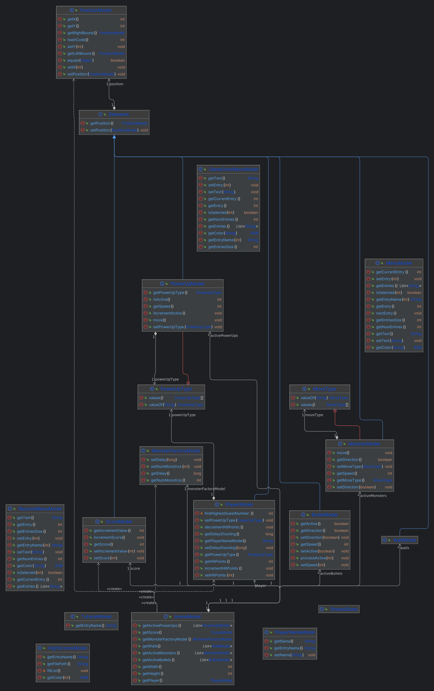
</a>

**Fig. 1: Model UML** - The Model encapsulates the data and related logical operations within the application.

## View
[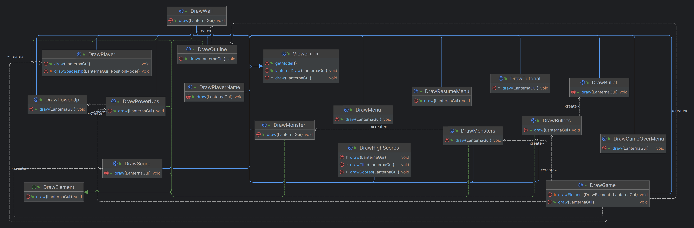](Docs/imgs/view.png)
**Fig. 2: View UML** - The View is responsible for presenting the data to the user. It defines how the application's data is displayed.

## Controller
[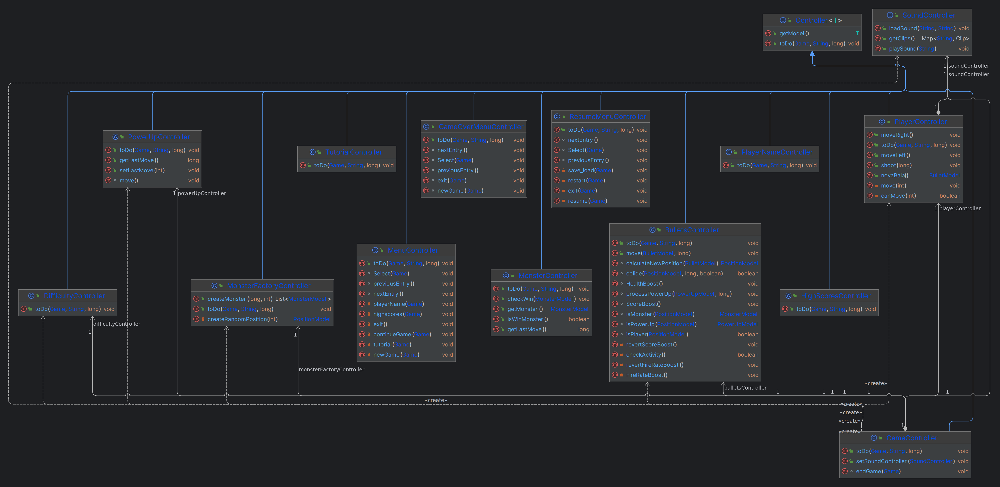](Docs/imgs/controller.png)
**Fig. 3: Controller UML** - The Controller acts as an intermediary between the Model and View. It manages user input, updates the Model, and ensures that changes in the Model are reflected in the View.

The Controller acts as an intermediary between the Model and View. It manages user input, updates the Model, and ensures that changes in the Model are reflected in the View.

## UML Overview
[Fig. 4: Project UML](Docs/imgs/project.png) - This is a clickable reference to the UML overview of the entire project.

The UML diagram provides an overview of the project's structure, showcasing the relationships between the Model, View, and other components.

# Design Patterns

## Observer Pattern (Sound Effects)
The Observer Pattern is employed to manage sound effects in the game. Sound effect subscribe to specific events (firing bullets or game over), and upon occurrence, these observers are notified to play the corresponding sound effects.

#### Implementation Details:
- [**SoundController.java:**](src/main/java/com/Carlos/spaceinvaders/controller/SoundController.java) Responsible for managing and triggering sound effects in response to specific game events.
- [**GameController:**](src/main/java/com/Carlos/spaceinvaders/controller/game/GameController.java) Utilizes the Observer Pattern to notify SoundController when relevant game over event occurs.
- [**PlayerController:**](src/main/java/com/Carlos/spaceinvaders/controller/game/PlayerController.java) Communicates with SoundController to play sound effects associated with firing bullets.

### UML Interaction Diagram
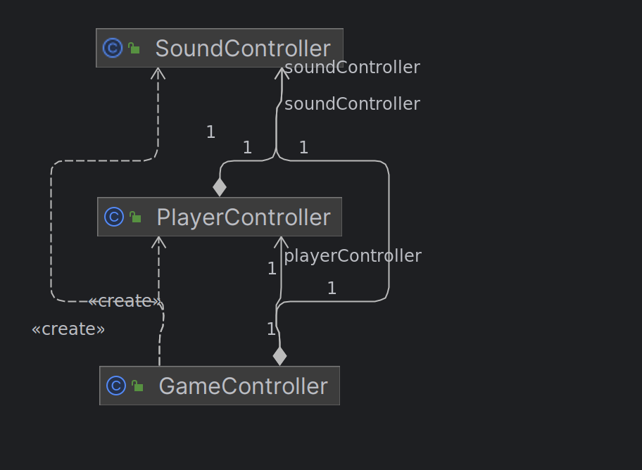

**Fig. 5: Observers Interaction Diagram**

The UML interaction diagram illustrates the communication flow between SoundController, GameController, and PlayerController in the context of sound effects management. This visual representation provides an overview of how these components interact during gameplay.

#### Advantages:
1. **Decoupling:** The Observer Pattern decouples sound effect logic from the core game functionality, allowing easy modification or extension of sound effects without affecting other parts of the game.

2. **Extensibility:** New sound effects can be seamlessly added by creating new observers, enhancing the variety of audio experiences without modifying existing sound effect or game logic.

3. **Dynamic Behavior:** Observers can dynamically subscribe or unsubscribe to events, providing flexibility in managing the playability of different sound effects based on game events.

## State Pattern (Game States)
The State Pattern is applied to manage different game states, such as the menu state, game state, and tutorial menu state. Each state is represented by a separate class, and the game context can transition between these states seamlessly.

#### Implementation Details:
- [**Game.java:**](src/main/java/com/Carlos/spaceinvaders/Game.java) Initializes the stack of states and sets up the initial state as the player name input state.
- [**GameState:**](src/main/java/com/Carlos/spaceinvaders/State/GameState.java) Represents the state of the game during normal gameplay.
- [**GameOverMenuState:**](src/main/java/com/Carlos/spaceinvaders/State/GameOverMenuState.java) Handles the game over menu state.
- [**HighScoreState:**](src/main/java/com/Carlos/spaceinvaders/State/HighScoresState.java) Manages the high score display state.
- [**MenuState:**](src/main/java/com/Carlos/spaceinvaders/State/MenuState.java) Represents the main menu state.
- [**PlayerNameState:**](src/main/java/com/Carlos/spaceinvaders/State/PlayerNameState.java) Manages the player name input state.
- [**ResumeMenuState:**](src/main/java/com/Carlos/spaceinvaders/State/ResumeMenuState.java) Handles the state when the player wants to resume the game.
- [**State (abstract):**](src/main/java/com/Carlos/spaceinvaders/State/State.java) An abstract class defining the core for all concrete states.
- [**TutorialState:**](src/main/java/com/Carlos/spaceinvaders/State/TutorialState.java) Represents the state during the tutorial.

### UML Interaction Diagram
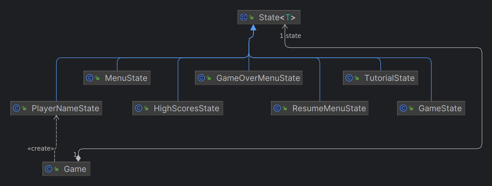
**Fig. 6: State Interaction Diagram**

#### Advantages:
1. **Clean State Transitions:** The State Pattern ensures clean transitions between different game states. This modular approach facilitates the addition, modification, or extension of states without affecting other states.

2. **Maintainability:** Each state encapsulates its behavior, enhancing the maintainability of the codebase. Changes or additions to one state do not impact the behavior of other states, contributing to a clearer and more manageable game logic.

3. **Readability:** The State Pattern improves code readability by providing a clear structure for handling different states. This aids in understanding and maintaining the overall game logic.

## Stack Usage in Game States:

The stack data structure plays a vital role in managing the hierarchical order of game states. In the context of Space Invaders, the stack (`Stack<State> states`) efficiently handles the flow and transitions between various states. Making it possible to transition between them and undo the last action without initializing any new states from scratch since that would result in data loss of the previous state.

### Stack Methods:
- **Push(State):** Adds a new state to the top of the stack.
- **Pop():** Removes the top state from the stack.
- **Peek():** Retrieves the state at the top of the stack without removing it.

The stack ensures that the current state is always at the top, simplifying access and manipulation during the game. As the game progresses, different states are pushed onto and popped off the stack based on user interactions and events.

## Strategy Pattern (Alien Invader Movement Strategies)
The Strategy Pattern is implemented to manage the movement strategies of alien invaders. Three different movement strategies (diagonal, horizontal, and vertical) are represented as separate strategy classes. The game can dynamically switch between these strategies during runtime.

#### Advantages:
1. **Flexibility:** The Strategy Pattern enables the game to easily switch between different movement strategies for alien invaders and apply a randomness to these alien invaders.

2. **Code Reusability:** Each movement strategy is encapsulated in its own class, promoting code reusability. It becomes straightforward to add new strategies or modify existing ones without affecting other parts of the code.

3. **Scalability:** The game can introduce new movement strategies seamlessly without altering the core codebase.

#### Implementation Details:

- [**DiagonalMovementStrategy.java:**](src/main/java/com/Carlos/spaceinvaders/controller/game/MonstersStrategy/DiagonalMovementStrategy.java) Implements the diagonal movement strategy for alien invaders.
- [**ShooterMovementStrategy.java:**](src/main/java/com/Carlos/spaceinvaders/controller/game/MonstersStrategy/ShooterMovementStrategy.java) Implements the horizontal movement strategy for alien invaders that can also shoot.
- [**VerticalMovementStrategy.java:**](src/main/java/com/Carlos/spaceinvaders/controller/game/MonstersStrategy/VerticalMovementStrategy.java) Implements the vertical movement strategy for alien invaders.
- [**MovementStrategy.java (abstract):**](src/main/java/com/Carlos/spaceinvaders/controller/game/MonstersStrategy/MovementStrategy.java) Defines the common interface for all movement strategies.

#### Related Controller:

- [**MonsterControllerFactory.java:**](src/main/java/com/Carlos/spaceinvaders/controller/game/MonsterControllerFactory.java) Creates controllers for different types of monsters, applying a random movement strategy on spawn.

### UML Interaction Diagram
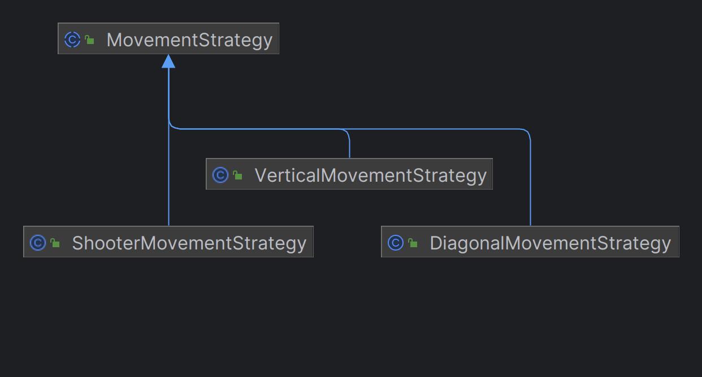
**Fig. 7: MonsterStrategy and Controller Interaction Diagram**

## OTHER DETAILS OF OUR PROJECT IMPLEMENTATION

### - Randomized Creation Strategies

### MonsterFactory
The `MonsterFactory` class incorporates a random creation strategy to diversify the types of monsters generated in the game. Instead of predetermining specific monster types, this approach uses randomness to introduce variability in monsters making use of the different strategies previously defined.

By utilizing a random strategy players encounter different monster types with varying movement patterns.

### Advantages:
1. **Dynamic Gameplay:** Randomized monster creation injects unpredictability into the game, ensuring that players face diverse challenges with each gameplay session.
2. **Difficulty**: This randomness made it easier for us to implement the difficulty controller that increases the rate of spawn of these random monsters as the score increases. 

#### Click for Implementation Details:
- [MonsterFactoryModel](src/main/java/com/Carlos/spaceinvaders/model/models/MonsterFactoryModel.java)
- [MonsterFactory](src/main/java/com/Carlos/spaceinvaders/controller/game/MonsterFactoryController.java)
- [MonsterControllerFactory](src/main/java/com/Carlos/spaceinvaders/controller/game/MonsterControllerFactory.java)

## PowerUpFactory
Similarly, the `PowerUpFactory` class employs a random creation strategy to introduce a wide range of power-ups during gameplay. Instead of static power-up behaviors, this approach ensures that players receive power-ups with varied effects and durations.

### Consequence:
1. **Diverse Power-Up Experience:** Randomized power-up creation ensures that players encounter a variety of power-ups, each offering unique benefits and gameplay enhancements.

#### Click for Implementation Details:
- [PowerUpModel](src/main/java/com/Carlos/spaceinvaders/model/models/PowerUpModel.java)
- [PowerUpController](src/main/java/com/Carlos/spaceinvaders/controller/game/PowerUpController.java)
- [PowerUpFactory](src/main/java/com/Carlos/spaceinvaders/controller/game/PowerUpFactory.java)

## TESTING

### Challenges with Movement Strategies
During our testing phase, one of the significant challenges encountered revolved around testing the movement strategies of monsters and the creation of power-ups. The inherent randomness embedded within these entities posed complexities in establishing consistent and deterministic test scenarios.
In the future one way to address this issue could be to use a random seed that initializes the behavior of monsters and power-ups. By setting a specific random seed, we can ensure reproducibility in our tests. This means that while the behavior remains random, it will be consistent across multiple test runs. 

### Code Coverage Report
For detailed insights into the code coverage metrics [Code Coverage Report](reports/coveragereport/index.html).

### Mutation Testing with Pitest
To evaluate the robustness of our tests, we utilized Pitest. A Pitest report provides a comprehensive mutation testing analysis to identify gaps in test coverage and assess the effectiveness of our test suite.
For detailed insights into the mutation testing results, you can check it here ! [Pitest Report](reports/pitest/202312222359/index.html).

## Known Code Smells 
### -Refused Bequest:
This happens when a subclass uses only some of the methods and properties inherited from its parents. <br>
We face this code smell in `MonsterFactoryController`, when the class which inrehits the controller, abstract class doesn't t have the toDo method implemented. <br>
This could be also found, in controllers which doesn't depend on the time of the game to perform their actions, leading to unnecessary arguments on the inherited function. <br>

We think that the payoff of the refactor wouldn't be worth, the work, so we decided to leave it like this.
### -Inappropriate Intimacy:
This happens when one class accesses the internal fields and methods of another class.<br>
We encounter this code smell while creating a monster and its controller within the `MonsterControllerFactory` when using methods from the `MonsterFactoryController`.<br>
We chose to perform the creation of monsters, their controllers, and the association with their movement in this manner, believing it would be a reliable approach to the problem.In the future a refactor could be an option to achieve a cleaner code and maintainable code.
## Screenshots

The following screenshots ilustrate the general look of our game, as well as the divergent functionalities:

### Game preview

<p align="center">
  
</p>
<p align="center">
  <b><i>Gif 1. Sneak peek into Space Invaders </i></b>
</p>
<br>
<br />

<p align="center">
  
</p>
<p align="center">
  <b><i>Gif 2. Another view of Space Invaders </i></b>
</p>
<br>
<br />

### Menus

#### Fig 8. Player ID
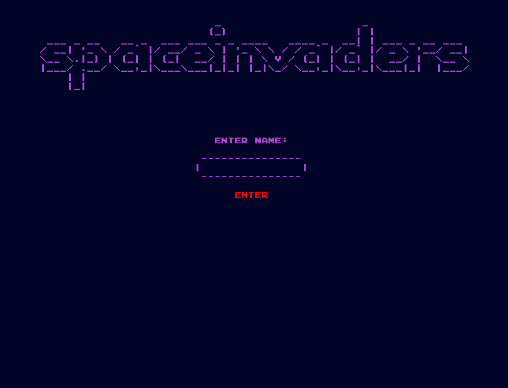

#### Fig 9. Main Menu
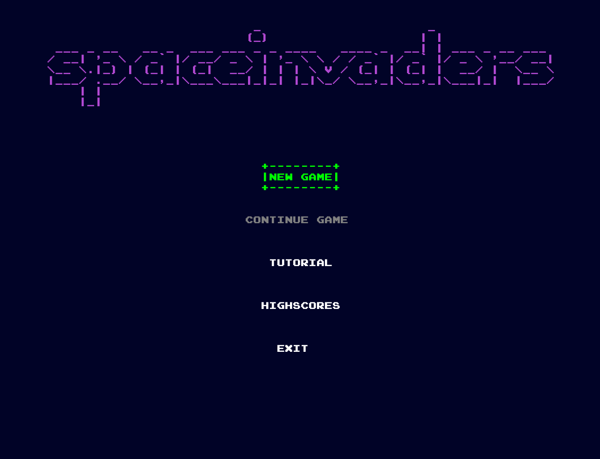

#### Fig 10. Tutorial
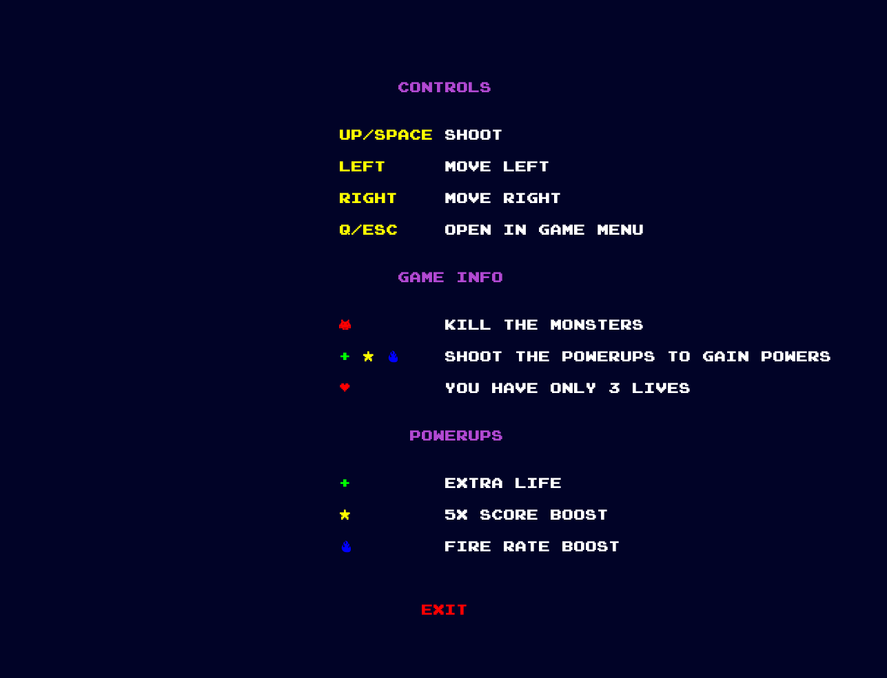

#### Fig 11. In-Game
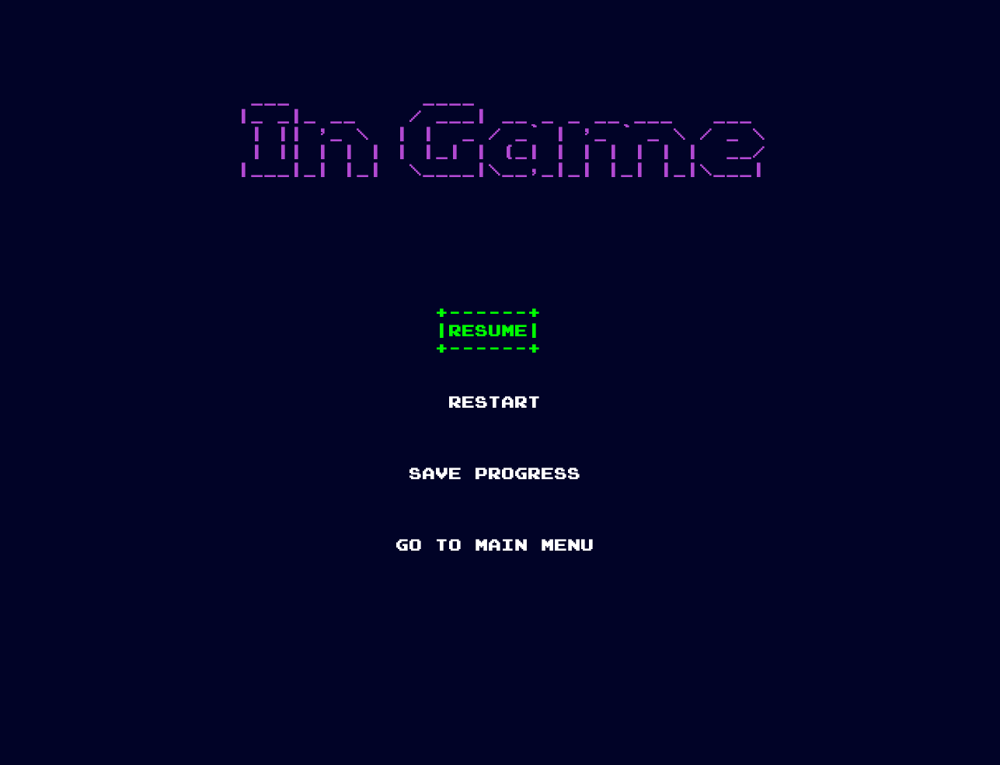

### End Game

<p align="center">
  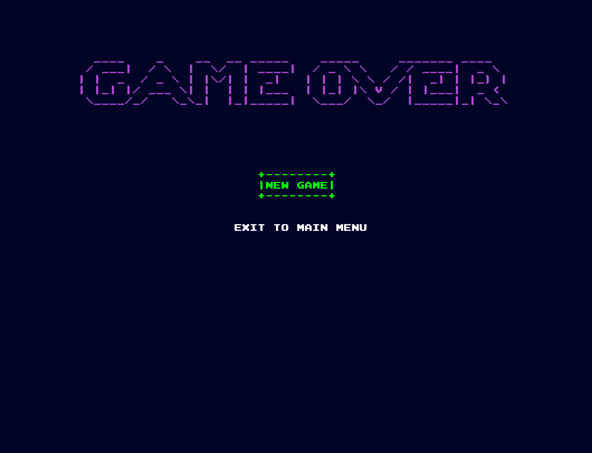
</p>
<p align="center">
  <b><i>Fig 12. Game Over!</i></b>
</p>

<br>
<br />

<p align="center">
  
</p>
<p align="center">
  <b><i>Gif 5. Losing the Game</i></b>
</p>

<br>
<br />

### SELF-EVALUATION

- Carlos Sanches: 33.4%
- João Rebelo: 33.3%
- Afonso Fernandes: 33.3%